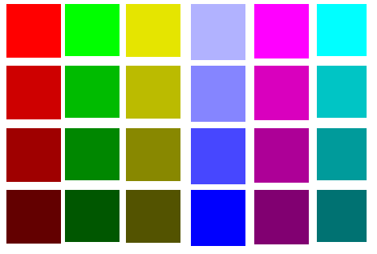

Contrasting colors
==================

### 1. Twelve dark ###

Twelve dark contrasting colors that I've used for line charts, to make sure each data series can be distinguished from the others. If you have more than 12 data series... well, you need to have fewer data series, IMO.

The colors are dark-ish so that they will work against a white or a light grey background. Other light pastel backgrounds should work as well.

    ['#BB2114', '#0C5966', '#BA7814', '#4459AB', '#6B3838', 
     '#B8327B', '#2B947F', '#0D83B5', '#684287', '#8C962C', 
     '#92289E', '#242D7D']

 [Visit a web tool](http://www.colorcombos.com/combomaker.html?design=squares&output_width=70&size_option=element&colors=BB2114,0C5966,BA7814,4459AB,6B3838,B8327B,2B947F,0D83B5,684287,8C962C,92289E,242D7D&background_color=FFFFFF&show_hex_flag=Y) that shows these colors.

### 2. Alan Gilbertson's 24 colors ###

(28 colors if you include grey)

    ['#ff0000', '#b00000', '#870000', '#550000', '#e4e400', 
     '#baba00', '#878700', '#545400', '#00ff00', '#00b000', 
     '#008700', '#005500', '#00ffff', '#00b0b0', '#008787', 
     '#005555', '#b0b0ff', '#8484ff', '#4949ff', '#0000ff', 
     '#ff00ff', '#b000b0', '#870087', '#550055', '#e4e4e4', 
     '#bababa', '#878787', '#545454']

From [this StackExchange post](http://graphicdesign.stackexchange.com/questions/3682/large-color-set-for-coloring-of-many-datasets-on-a-plot)

### 3. More pastel-y ColorBrewer Paired ###

I modified the ColorBrewer Paired set to be more pastel-like

    ['#a6cee3', '#5c9dc9', '#b2df8a', '#6accb3', '#fb9a99', '#e56969',
     '#fdbf6f', '#ff7f00', '#c397db', '#a868c4', '#e5e5a0', '#c47a52']

